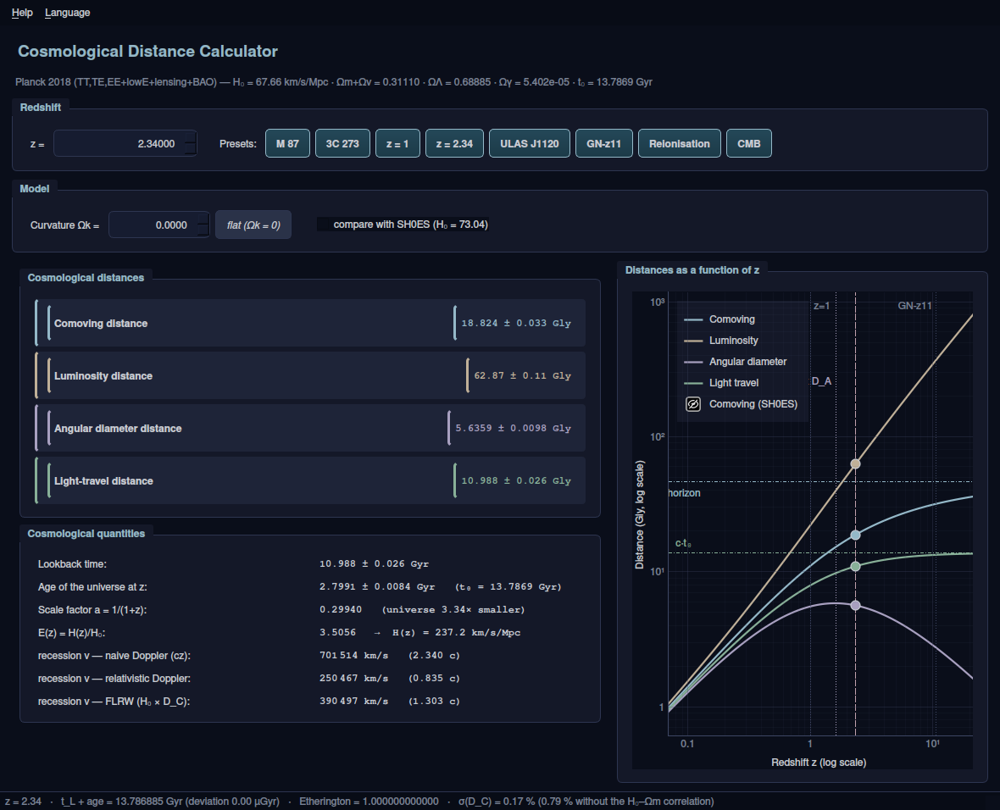

# Cosmology — from redshift to distances

*[Version française](README.md)*

[](https://github.com/ARP273-ROSE/cosmologie-redshift/releases/latest)
[](https://github.com/ARP273-ROSE/cosmologie-redshift/actions/workflows/release.yml)
[](https://www.python.org/)

Interactive **redshift → cosmological distance** calculator (PyQt6), together
with a **64-page course** written at three reading levels and an **audit
report** with an independent verification in SageMath.

Model: ΛCDM constrained by **Planck 2018** (`astropy.cosmology.Planck18`).

The program is **bilingual** (French / English): use the *Language* menu,
`--lang en`, or the `COSMO_LANG=en` environment variable.



---

## Repository contents

| Folder / file | Contents |
|---|---|
| `launch.bat` / `launch.sh` | Windows and Linux/macOS launchers (venv + dependencies handled automatically) |
| `programme/` | the Qt6 application, its console version and the computation core |
| `cours/` | the course, in French (`cours_distances_cosmologiques.pdf`) and English (`course_cosmological_distances.pdf`, 64 pp.) |
| `audit/` | `AUDIT_cosmologie.pdf` (11 pp.): audit of the code, of the displayed data and of the course |
| `verif_sage/` | verification scripts (SageMath without astropy + symbolic algebra) |
| `requirements.txt` | numpy, scipy, astropy, PyQt6, pyqtgraph |

**Documents to read**:
- [`MANUAL.md`](MANUAL.md) — installation, usage, rebuilding, troubleshooting
- [`PROGRESS.md`](PROGRESS.md) — project status, history, what is left to do

---

## Installation

### 1. Simplest: the standalone executable (no prerequisite)

Nothing to install, no Python needed: a single file to download.

| System | Download | First run |
|---|---|---|
| **Windows** | [⬇ .exe](https://github.com/ARP273-ROSE/cosmologie-redshift/releases/latest/download/CosmologicalDistanceCalculator-windows.exe) | double-click. SmartScreen warns that the program is unsigned: *More info* → *Run anyway* |
| **macOS (Apple Silicon)** | [⬇ .zip](https://github.com/ARP273-ROSE/cosmologie-redshift/releases/latest/download/CosmologicalDistanceCalculator-macos-apple-silicon.zip) | unzip, then **right-click → Open** the first time |
| **macOS (Intel)** | *being built* | until then, run from source (§2): the launcher installs everything |
| **Linux (x86_64)** | [⬇ binary](https://github.com/ARP273-ROSE/cosmologie-redshift/releases/latest/download/CosmologicalDistanceCalculator-linux-x86_64) | `chmod +x` then run |

These links always point at the most recent version.

### 2. From source

```bash
git clone https://github.com/ARP273-ROSE/cosmologie-redshift.git
cd cosmologie-redshift
./launch.sh              # Linux, macOS   (launch.bat on Windows)
```

**If Python is not installed, the launcher takes care of it**: winget or the
official installer on Windows, Homebrew on macOS, the system package manager on
Linux (apt, dnf, pacman, zypper, apk). It asks before installing anything;
`COSMO_AUTO_INSTALL=1` accepts automatically. It then creates the virtual
environment and installs the dependencies.

| Command | Effect |
|---|---|
| `./launch.sh` | graphical interface |
| `./launch.sh console 2.34` | console version, one redshift |
| `./launch.sh table` | table of the eight presets |
| `./launch.sh doctor` | diagnostics if the installation fails |

On Windows, replace `./launch.sh` with `launch.bat`; the sub-commands are the
same, and `launch.bat help` lists them.

**Language**: the *Language* menu, `--lang en`, or `COSMO_LANG=en`. By default
the program follows the system locale.

**Updates**: the program quietly checks at start-up whether a newer release
exists (anonymous request, never blocking, disabled with
`COSMO_NO_UPDATE_CHECK=1`). *Help → Check for updates* does the same on demand.

---

## What the program shows

For a redshift `z` between 0 and 1500:

**Four distances** — comoving `D_C`, luminosity `D_L = (1+z)D_M`,
angular diameter `D_A = D_M/(1+z)`, light-travel `D_lt = c·t_L`.

**Error bars** — every value comes with its 1σ uncertainty, propagated from
σ(H₀) = 0.42 and σ(Ωm) = 0.0056 **taking their correlation into account**
(ρ = −0.976, derived from the constraint on ω_m = Ωm h²). At z = 2.34: ±0.17 %,
against ±0.79 % if that cross term is ignored.

**Curvature Ωk** — adjustable field (±0.05). As soon as Ωk ≠ 0 the
**transverse** comoving distance D_M appears and replaces D_C in D_L and D_A.

**SH0ES comparison** — a checkbox shows the same quantities computed with
H₀ = 73.04 (all distances shrink by 7.4 %) and overlays the corresponding
dotted curves.

**Cosmological quantities** — lookback time, age of the universe at `z`,
scale factor `a = 1/(1+z)`, `E(z) = H(z)/H₀` and `H(z)`.

**Three recession velocities**, because they differ radically and two of them
are approximations:

| Definition | at z = 2.34 | status |
|---|---|---|
| naive Doppler `v = cz` | 2.340 c | valid only for z ≪ 1 |
| relativistic Doppler | 0.835 c | conceptually inappropriate in cosmology |
| FLRW `v = H₀·D_C` | 1.303 c | **the right one** |

**Two permanent checks** in the status bar: `t_L + t_em = t₀` and the
Etherington identity `D_L = (1+z)²D_A`.

**A log-log plot** of the four distances, with markers (z = 1, maximum of
`D_A`, GN-z11, CMB) and asymptotes (`c·t₀`, particle horizon).

---

## Numerical landmarks (Planck 2018)

| Quantity | Value |
|---|---|
| H₀ | 67.66 ± 0.42 km/s/Mpc |
| Ω_m + Ω_ν | 0.31110 (of which Ω_ν = 0.00144) |
| Ω_Λ | 0.68885 |
| Ω_γ | 5.402 × 10⁻⁵ |
| Age of the universe t₀ | 13.786885 Gyr |
| Hubble distance D_H = c/H₀ | 4 430.87 Mpc = **14.4516 Gly** |
| Particle horizon | 46.2005 Gly |
| Event horizon | 16.5808 Gly |
| Maximum of D_A | 5.84629 Gly at **z = 1.592133** |

### Two traps that proved costly

1. **`Planck18.Om0 = 0.30966`, not 0.3111.** The « Ω_m = 0.3111 » of the Planck
   paper is `Om0 + Onu0`: neutrinos, being non-relativistic today, are counted
   as matter there, whereas astropy keeps them separate.
2. **`E(z) = √(Ω_m(1+z)³ + Ω_Λ)` is not the formula in use.** The real one is
   `E² = Ω_r(z)(1+z)⁴ + Ω_m(1+z)³ + Ω_k(1+z)² + Ω_Λ`, where `Ω_r(z)` contains
   the photons *and* the neutrinos. The simplified version underestimates `E`
   by 12.8 % at the CMB and would give an age of 479 kyr instead of 372 kyr.

---

## Verification of the calculations

Everything has been recomputed **without astropy** in SageMath: densities
rebuilt from the CODATA 2022 constants, exact Fermi-Dirac integral for the
massive neutrinos, mpmath quadrature at 25 digits. The series expansions were
re-derived symbolically.

| Quantity | astropy ↔ SageMath difference |
|---|---|
| E(z) | 1.8 × 10⁻⁵ |
| D_C, D_L, D_A | 2.1 × 10⁻⁶ |
| lookback time | 4.6 × 10⁻⁷ |
| age | 1.5 × 10⁻⁵ |

The residual difference comes solely from the Komatsu (2011) fit that astropy
uses for the neutrino density. For reference, the uncertainty of the Planck
parameters themselves is about 0.5 %, and the Hubble tension amounts to 7 %.

Full details: [`audit/AUDIT_cosmologie.pdf`](audit/AUDIT_cosmologie.pdf)
(in French).

---

## Source of the parameters

Aghanim *et al.* (Planck Collaboration), *Planck 2018 results. VI. Cosmological
parameters*, A&A **641**, A6 (2020) —
[arXiv:1807.06209](https://arxiv.org/abs/1807.06209), Table 2, column
`TT,TE,EE+lowE+lensing+BAO`.

## Licence

No formal licence; personal and educational use.
