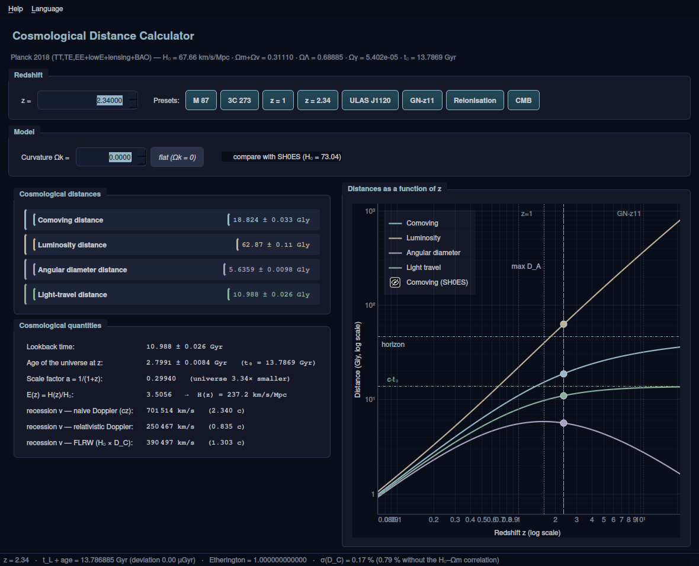

# Cosmologie — du redshift aux distances

*[English version](README.md)*

[](https://github.com/ARP273-ROSE/cosmologie-redshift/releases/latest)
[](https://github.com/ARP273-ROSE/cosmologie-redshift/actions/workflows/release.yml)
[](https://www.python.org/)

Calculateur interactif **redshift → distances cosmologiques** (PyQt6), accompagné
d'un **cours de 68 pages** en trois niveaux de lecture, et d'une vérification
indépendante de tous les nombres sous SageMath.

Modèle : ΛCDM contraint par **Planck 2018** (`astropy.cosmology.Planck18`).

Le programme est **bilingue** (français / anglais) : menu *Langue*, `--lang en`,
ou variable `COSMO_LANG=en`. Le cours existe dans les deux langues.



---

## Contenu du dépôt

| Dossier / fichier | Contenu |
|---|---|
| `launch.bat` / `launch.sh` | lanceurs Windows et Linux/macOS (venv + dépendances automatiques) |
| `programme/` | l'application Qt6, sa version console et le noyau de calcul |
| `cours/` | le cours en français (`cours_distances_cosmologiques.pdf`, 68 p.) et en anglais (`course_cosmological_distances.pdf`, 64 p.) |
| `verif_sage/` | scripts de vérification (SageMath sans astropy + calcul formel) |
| `requirements.txt` | numpy, scipy, astropy, PyQt6, pyqtgraph |

**Documents à lire** :
- [`MANUEL.md`](MANUEL.md) — installation, utilisation, recompilation, dépannage
- [`PROGRESSION.md`](PROGRESSION.md) — état du projet, historique, ce qui reste à faire

---

## Installation

### 1. Le plus simple : l'exécutable autonome (aucun prérequis)

Rien à installer, pas besoin de Python : un seul fichier à télécharger.

| Système | Téléchargement | Premier lancement |
|---|---|---|
| **Windows** | [⬇ .exe](https://github.com/ARP273-ROSE/cosmologie-redshift/releases/latest/download/CosmologicalDistanceCalculator-windows.exe) | double-clic. SmartScreen prévient que le programme n'est pas signé : *Informations complémentaires* → *Exécuter quand même* |
| **macOS (Apple Silicon)** | [⬇ .zip](https://github.com/ARP273-ROSE/cosmologie-redshift/releases/latest/download/CosmologicalDistanceCalculator-macos-apple-silicon.zip) | décompresser, puis **clic droit → Ouvrir** la première fois |
| **macOS (Intel)** | *en construction* | en attendant, passer par les sources (§2) : le lanceur installe tout |
| **Linux (x86_64)** | [⬇ binaire](https://github.com/ARP273-ROSE/cosmologie-redshift/releases/latest/download/CosmologicalDistanceCalculator-linux-x86_64) | `chmod +x` puis exécuter |

Ces liens pointent toujours vers la version la plus récente.

### 2. Depuis les sources

```bash
git clone https://github.com/ARP273-ROSE/cosmologie-redshift.git
cd cosmologie-redshift
./launch.sh              # Linux, macOS   (launch.bat sous Windows)
```

**Si Python n'est pas installé, le lanceur s'en occupe** : winget ou l'installeur
officiel sous Windows, Homebrew sous macOS, le gestionnaire de paquets du
système sous Linux (apt, dnf, pacman, zypper, apk). Il demande confirmation
avant d'installer quoi que ce soit ; `COSMO_AUTO_INSTALL=1` accepte d'office.
Il crée ensuite l'environnement virtuel et installe les dépendances.

| Commande | Effet |
|---|---|
| `./launch.sh` | interface graphique |
| `./launch.sh console 2.34` | version console, un redshift |
| `./launch.sh table` | table des huit presets |
| `./launch.sh doctor` | diagnostic si l'installation coince |

Sous Windows, remplacer `./launch.sh` par `launch.bat` ; les sous-commandes sont
identiques et `launch.bat help` les rappelle.

**Langue** : menu *Langue* dans l'interface, `--lang en`, ou `COSMO_LANG=en`.
Par défaut, le programme suit la locale du système.

**Mises à jour** : le programme vérifie discrètement au démarrage si une version
plus récente est publiée (requête anonyme, jamais bloquante, désactivable par
`COSMO_NO_UPDATE_CHECK=1`). *Aide → Vérifier les mises à jour* fait de même à la
demande.

---

## Ce que le programme affiche

Pour un redshift `z` entre 0 et 1500 :

**Quatre distances** — comobile `D_C`, luminosité `D_L = (1+z)D_C`,
diamètre angulaire `D_A = D_C/(1+z)`, trajet de la lumière `D_lt = c·t_L`.

**Barres d'erreur** — chaque valeur est donnée avec son incertitude 1σ, propagée
de σ(H₀) = 0,42 et σ(Ωm) = 0,0056 **en tenant compte de leur corrélation**
(ρ = −0,976, déduite de la contrainte sur ω_m = Ωm h²). À z = 2,34 : ±0,17 %,
contre ±0,79 % si l'on ignore ce terme croisé.

**Courbure Ωk** — champ réglable (±0,05). Dès que Ωk ≠ 0, la distance comobile
**transverse** D_M apparaît et remplace D_C dans D_L et D_A.

**Comparaison SH0ES** — une case affiche en regard les mêmes grandeurs avec
H₀ = 73,04 (toutes les distances raccourcissent de 7,4 %) et superpose les
courbes en pointillé.

**Grandeurs cosmologiques** — lookback time, âge de l'univers à `z`,
facteur d'échelle `a = 1/(1+z)`, `E(z) = H(z)/H₀` et `H(z)`.

**Trois vitesses de récession**, parce qu'elles diffèrent radicalement et que
deux d'entre elles sont des approximations :

| Définition | à z = 2,34 | statut |
|---|---|---|
| Doppler naïf `v = cz` | 2,340 c | valable seulement si z ≪ 1 |
| Doppler relativiste | 0,835 c | conceptuellement inadaptée en cosmologie |
| FLRW `v = H₀·D_C` | 1,303 c | **la bonne** |

**Deux contrôles permanents** en barre d'état : `t_L + t_em = t₀` et l'identité
d'Etherington `D_L = (1+z)²D_A`.

**Un tracé log-log** des quatre distances, avec repères (z=1, maximum de `D_A`,
GN-z11, CMB) et asymptotes (`c·t₀`, horizon des particules).

---

## Repères numériques (Planck 2018)

| Grandeur | Valeur |
|---|---|
| H₀ | 67,66 ± 0,42 km/s/Mpc |
| Ω_m + Ω_ν | 0,31110 (dont Ω_ν = 0,00144) |
| Ω_Λ | 0,68885 |
| Ω_γ | 5,402 × 10⁻⁵ |
| Âge de l'univers t₀ | 13,786885 Gyr |
| Distance de Hubble D_H = c/H₀ | 4 430,87 Mpc = **14,4516 G al** |
| Horizon des particules | 46,2005 G al |
| Horizon des événements | 16,5808 G al |
| Maximum de D_A | 5,84629 G al à **z = 1,592133** |

### Deux pièges qui ont coûté cher

1. **`Planck18.Om0 = 0,30966`, pas 0,3111.** Le « Ω_m = 0,3111 » du papier Planck
   vaut `Om0 + Onu0` : les neutrinos, non relativistes aujourd'hui, y sont comptés
   dans la matière, alors qu'astropy les porte à part.
2. **`E(z) = √(Ω_m(1+z)³ + Ω_Λ)` n'est pas la formule utilisée.** La vraie est
   `E² = Ω_r(z)(1+z)⁴ + Ω_m(1+z)³ + Ω_k(1+z)² + Ω_Λ`, où `Ω_r(z)` contient les
   photons *et* les neutrinos. La version simplifiée sous-estime `E` de 12,8 % au
   CMB et donnerait un âge de 479 kyr au lieu de 372 kyr.

---

## Vérification des calculs

Tout a été recalculé **sans astropy** sous SageMath : reconstruction des densités
depuis les constantes CODATA 2022, intégrale de Fermi-Dirac exacte pour les
neutrinos massifs, quadratures mpmath à 25 chiffres. Les développements limités
ont été redémontrés en calcul formel.

| Grandeur | Écart astropy ↔ SageMath |
|---|---|
| E(z) | 1,8 × 10⁻⁵ |
| D_C, D_L, D_A | 2,1 × 10⁻⁶ |
| lookback time | 4,6 × 10⁻⁷ |
| âge | 1,5 × 10⁻⁵ |

L'écart résiduel vient uniquement de l'ajustement de Komatsu (2011) qu'utilise
astropy pour la densité des neutrinos. Pour mémoire, l'incertitude des paramètres
Planck eux-mêmes est de ~0,5 %, et la tension de Hubble représente 8 %.

Les scripts sont dans `verif_sage/` et peuvent être relancés à tout moment ;
l'annexe du cours détaille la méthode.

---

## Source des paramètres

Aghanim *et al.* (Planck Collaboration), *Planck 2018 results. VI. Cosmological
parameters*, A&A **641**, A6 (2020) — [arXiv:1807.06209](https://arxiv.org/abs/1807.06209),
tableau 2, colonne `TT,TE,EE+lowE+lensing+BAO`.

## Licence

Sans licence formelle, pour usage personnel et pédagogique.
